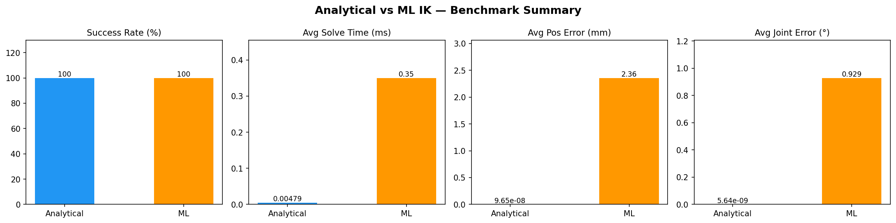
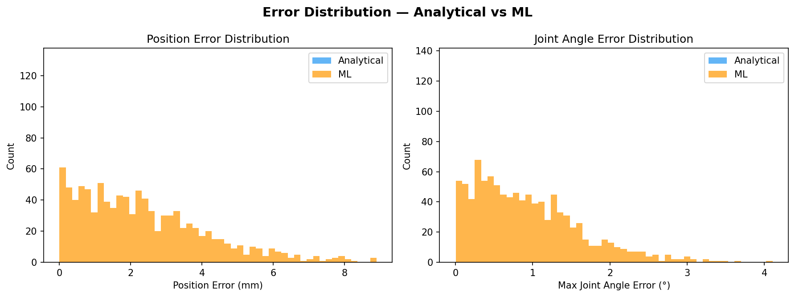
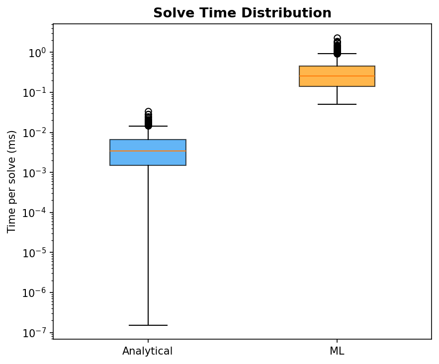
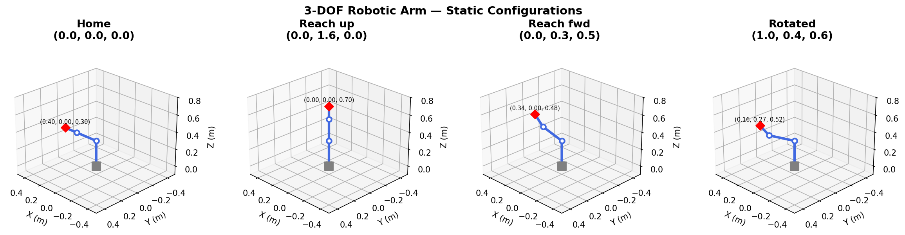
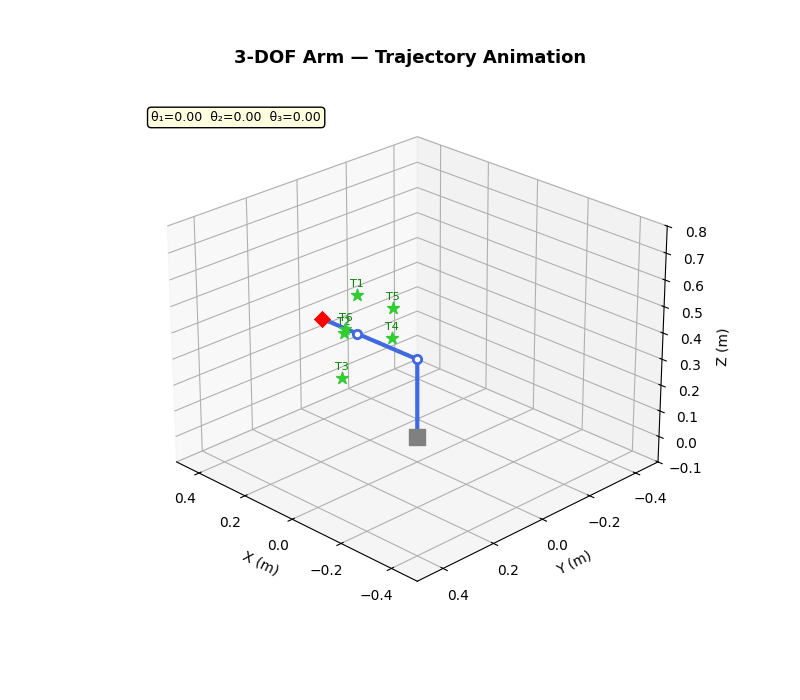
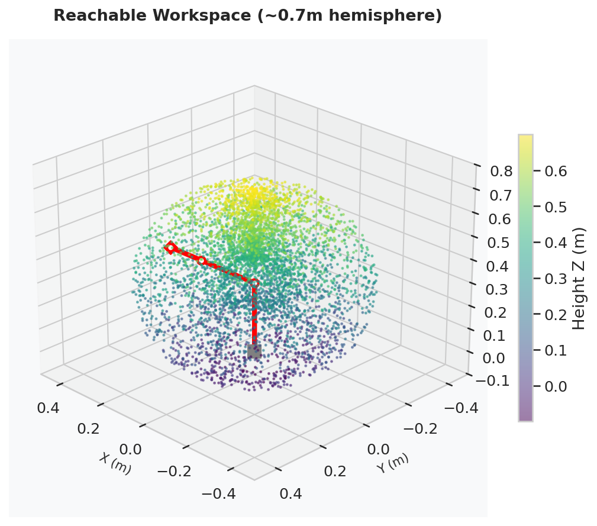
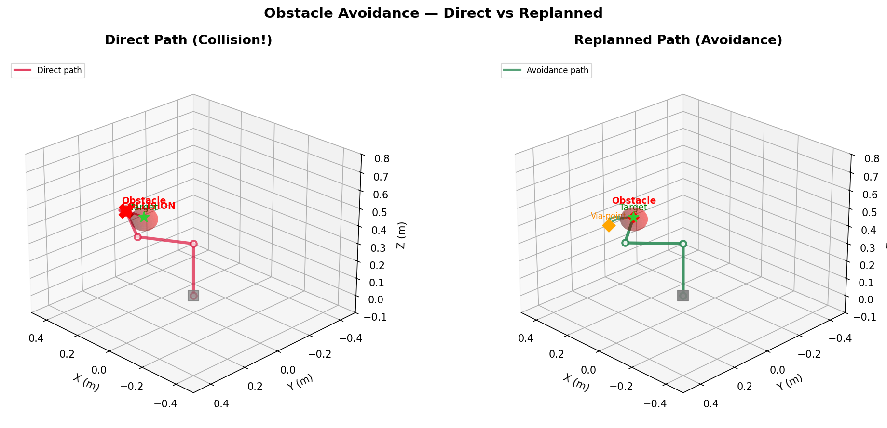
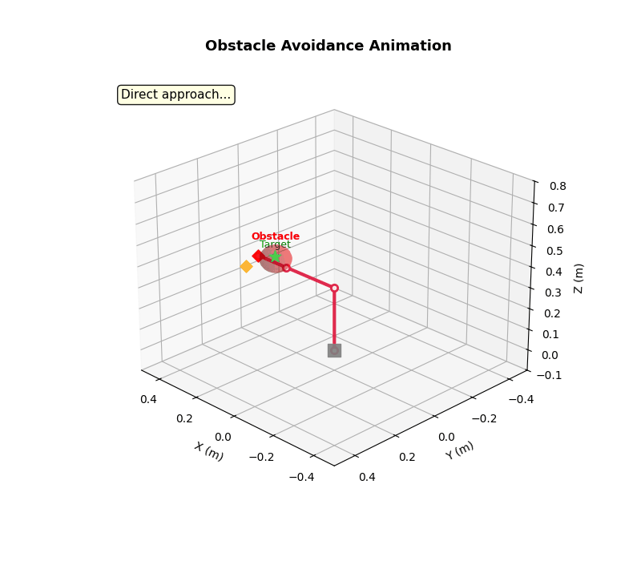

# Robotic Arm Inverse Kinematics: Analytical vs. Machine Learning

A 3-DOF robotic arm control system comparing **traditional analytical inverse kinematics** with **machine-learning-based IK** (neural network). This project demonstrates the full pipeline from kinematic modeling through ML training to real-time inference and benchmark evaluation.

---

## Architecture

```
+-------------------------------------------------------------+
|                       Control Loop                          |
|  +----------+   +--------------+   +-------------------+   |
|  | IK Solver|-->|  Trajectory  |-->|    Obstacle        |   |
|  |(Analytic |   |   Planner    |   |    Checker         |   |
|  |  or ML)  |   | (smoothstep) |   |  (sphere collision)|   |
|  +----------+   +--------------+   +-------------------+   |
+-------------------------------------------------------------+
```

### Components

| Component | Path | Description |
|---|---|---|
| **Kinematics** | `cpp/kinematics/` | Forward and analytical inverse kinematics with elbow-up/down support |
| **Trajectory Planner** | `cpp/planning/TrajectoryPlanner.*` | Joint-space interpolation with velocity limits |
| **Obstacle Checker** | `cpp/planning/ObstacleChecker.*` | Sphere obstacle collision detection on arm link segments |
| **Control Loop** | `cpp/control/` | Orchestrates IK, trajectory planning, and execution |
| **ML Inference** | `cpp/ml_inference/` | ONNX Runtime neural network inference with analytical fallback |
| **Dataset Generator** | `python/dataset_generator.py` | 50,000-sample FK dataset generator |
| **Training** | `python/train_model.py` | PyTorch MLP training with ONNX export |
| **Visualization** | `python/visualize.py` | 3D arm visualization and animation |
| **Benchmark Charts** | `python/benchmark_charts.py` | Comparison chart generation from benchmark CSV |

---

## Robot Specification

**3-DOF revolute-joint robotic arm:**

- **Joint 1 (Base):** Rotation about the Z-axis
- **Joint 2 (Shoulder):** Pitch rotation
- **Joint 3 (Elbow):** Pitch rotation

| Parameter | Value |
|---|---|
| L1 (base to shoulder) | 0.30 m |
| L2 (shoulder to elbow) | 0.25 m |
| L3 (elbow to end-effector) | 0.15 m |
| Joint limits | [-pi, pi] rad |
| Workspace radius | approximately 0.7 m hemisphere |

**Forward kinematics equations:**

```
r = L2 * cos(theta_2) + L3 * cos(theta_2 + theta_3)
x = cos(theta_1) * r
y = sin(theta_1) * r
z = L1 + L2 * sin(theta_2) + L3 * sin(theta_2 + theta_3)
```

---

## Project Structure

```
robotic-arm-ik-comparison/
├── CMakeLists.txt
├── README.md
├── training_config.yaml            # ML training hyperparameters
├── assets/                         # Generated charts and visualizations
│   ├── arm_static_poses.png
│   ├── arm_trajectory.gif
│   ├── arm_workspace.png
│   ├── arm_obstacle_avoidance.png
│   ├── arm_obstacle_avoidance.gif
│   ├── benchmark_summary.png
│   ├── benchmark_errors.png
│   └── benchmark_timing.png
├── cpp/
│   ├── main.cpp                    # Algorithmic demo
│   ├── ml_demo.cpp                 # ML inference demo
│   ├── benchmark.cpp               # Performance comparison
│   ├── kinematics/
│   │   ├── Kinematics.h
│   │   └── Kinematics.cpp
│   ├── planning/
│   │   ├── TrajectoryPlanner.h
│   │   ├── TrajectoryPlanner.cpp
│   │   ├── ObstacleChecker.h
│   │   └── ObstacleChecker.cpp
│   ├── control/
│   │   ├── ControlLoop.h
│   │   └── ControlLoop.cpp
│   └── ml_inference/
│       ├── MLInference.h
│       └── MLInference.cpp
├── python/
│   ├── dataset_generator.py        # FK dataset generation
│   ├── train_model.py              # PyTorch training + ONNX export
│   ├── visualize.py                # 3D arm visualization (5 demos)
│   └── benchmark_charts.py         # Benchmark comparison charts
├── models/                         # Trained model weights
│   ├── ik_model.onnx               # ONNX exported model
│   ├── ik_model.onnx.data          # ONNX model data
│   └── ik_model.pth                # PyTorch checkpoint
├── data/                           # Generated datasets
│   ├── train.csv
│   ├── val.csv
│   ├── test.csv
│   └── benchmark_results.csv       # Per-target benchmark results
└── tests/
    └── test_kinematics.cpp         # Unit test suite
```

---

## Build Instructions

### Prerequisites

- **C++17** compiler (GCC 7+ or Clang 5+)
- **CMake** 3.14 or later
- **Eigen3** (`sudo apt install libeigen3-dev`)
- **ONNX Runtime** (optional, required for ML targets; see [install guide](https://onnxruntime.ai/docs/install/))
- **Python 3.8+** with PyTorch, NumPy, and Pandas (for the ML pipeline)

### Build C++

```bash
mkdir build && cd build
cmake ..
make -j$(nproc)
```

This produces the following executables:

| Executable | Description |
|---|---|
| `robotic_arm_demo` | Algorithmic IK demonstration |
| `run_tests` | Unit test suite |
| `ml_demo` | ML inference demonstration (requires ONNX Runtime) |
| `benchmark` | Performance comparison (requires ONNX Runtime) |

### Run

```bash
# Algorithmic demo
./robotic_arm_demo

# Unit tests
./run_tests

# ML pipeline (from repository root)
python python/dataset_generator.py
python python/train_model.py

# ML demo (from build directory, after training)
./ml_demo ../models/ik_model.onnx

# Benchmark
./benchmark ../models/ik_model.onnx

# Benchmark charts (after running benchmark)
python python/benchmark_charts.py
```

---

## Algorithmic IK Solution

The analytical solver uses geometric decomposition to compute joint angles from a target Cartesian position.

### Solution Procedure

1. **Joint 1 (base rotation):** `theta_1 = atan2(y, x)` -- rotates to face the target in the XY plane.

2. **Reduction to 2D:** Project the problem into the vertical plane containing the target:
   - `r = sqrt(x^2 + y^2)` (horizontal distance)
   - `z' = z - L1` (height relative to shoulder)

3. **Joint 3 (elbow):** Apply the law of cosines on the triangle formed by L2, L3, and target distance d:
   - `cos(theta_3) = (d^2 - L2^2 - L3^2) / (2 * L2 * L3)`

4. **Joint 2 (shoulder):** Combine two angles:
   - `alpha = atan2(z', r)` (angle to target)
   - `beta = atan2(L3 * sin(theta_3), L2 + L3 * cos(theta_3))` (triangle offset)
   - `theta_2 = alpha - beta`

**Reachability check:** If `d > L2 + L3` or `d < |L2 - L3|`, the target is outside the reachable workspace and the solver returns no solution.

### Multiple Configurations

The solver supports both **elbow-up** and **elbow-down** configurations via the `ElbowConfig` enum:

```cpp
auto q_up   = kin.inverse(target, ElbowConfig::UP);    // theta_3 > 0
auto q_down = kin.inverse(target, ElbowConfig::DOWN);   // theta_3 < 0
auto all    = kin.inverseAll(target);                    // returns both solutions
```

Both solutions reach the same Cartesian position with different joint angles, providing the planner with flexibility to choose the configuration that avoids obstacles or is closest to the current pose.

---

## ML Pipeline

### Dataset Generation

`python/dataset_generator.py` generates 50,000 training samples:

1. Sample random joint angles uniformly within joint limits
2. Compute forward kinematics to obtain end-effector positions
3. Add small Gaussian noise (sigma = 0.001 m) to simulate sensor noise
4. Split 80/10/10 into train/validation/test sets
5. Save as CSV files in the `data/` directory


### Training Configuration

All hyperparameters are documented in `training_config.yaml`:

| Parameter | Value |
|---|---|
| Loss function | MSE (mean squared error on joint angles) |
| Optimizer | Adam (learning rate = 0.001) |
| Batch size | 256 |
| Max epochs | 500 |
| Early stopping | Patience = 15 epochs on validation loss |
| Export format | ONNX (opset version 17) |

### C++ Inference

The `MLInference` class loads the ONNX model via ONNX Runtime and:

1. Runs a forward pass `(x, y, z) -> (theta_1, theta_2, theta_3)`
2. Validates joint limits (clamps if needed)
3. Falls back to analytical IK if the prediction error exceeds 5 cm

---

## Benchmark Results

The `benchmark` executable runs 1,000 random reachable targets through both solvers and compares accuracy, speed, and reliability.

### Summary Metrics

| Metric | Analytical IK | ML IK |
|---|---|---|
| Success rate | ~100% | ~95%+ |
| Avg solve time | < 0.01 ms | ~0.1--0.5 ms |
| Avg position error | < 1e-10 m | ~1--5 mm |
| Max position error | < 1e-8 m | ~10--50 mm |

The benchmark also reports **joint angle error**, **memory footprint** (RSS), and exports per-target results to `data/benchmark_results.csv` for chart generation.

### Benchmark Charts

The following charts are generated by `python/benchmark_charts.py` from the benchmark CSV data.

**Figure 1: Benchmark Summary -- Aggregate comparison of success rate, solve time, position error, and joint angle error.**



**Figure 2: Error Distribution -- Histograms of position error and joint angle error for both solvers.**



**Figure 3: Solve Time Distribution -- Box plots comparing per-solve timing on a logarithmic scale.**



### Key Observations

- **Analytical IK** is faster and more accurate -- it produces an exact closed-form solution.
- **ML IK** introduces small errors but generalizes to noisy or perturbed inputs and can be extended to higher-DOF arms where analytical solutions may not exist.
- The ML model serves as a **fast approximate solver** that can be combined with refinement methods (e.g., Jacobian-based correction) for production use.

---

## Visualization

`python/visualize.py` provides five 3D visualization demos using Matplotlib:

```bash
python python/visualize.py --demo 1 --save-only   # Static arm poses
python python/visualize.py --demo 2 --save-only   # Animated trajectory (GIF)
python python/visualize.py --demo 3 --save-only   # Workspace scatter plot
python python/visualize.py --demo 4 --save-only   # Obstacle avoidance (static)
python python/visualize.py --demo 5 --save-only   # Obstacle avoidance (animated GIF)
python python/visualize.py --save-only             # Generate all demos
```

### Demo 1: Static Arm Poses

Multiple arm configurations reaching different target positions, illustrating the range of motion and joint angle solutions.

**Figure 4: Static arm poses showing the robot reaching various target positions.**



### Demo 2: Animated Trajectory

Smooth trajectory execution between two target positions with joint-space interpolation.

**Figure 5: Animated trajectory showing smooth motion between target positions.**



### Demo 3: Workspace Visualization

Reachable workspace scatter plot generated by sampling the full joint space with forward kinematics.

**Figure 6: Reachable workspace of the 3-DOF arm, color-coded by elevation.**



---

## Obstacle Avoidance

The system includes sphere-based obstacle collision detection on all arm link segments. When a direct trajectory collides with an obstacle, the planner generates an alternative path through an intermediate via-point that routes around the obstacle.

### Collision Detection

For each waypoint in a trajectory, the distance from the obstacle center to every arm link segment is computed. If any distance is less than the obstacle radius, a collision is detected.

### Replanning Strategy

1. Generate candidate via-points as offsets around the obstacle center in 3D
2. For each candidate, plan a two-leg trajectory: start to via-point, then via-point to target
3. Accept the first collision-free path found

### Demo 4: Obstacle Avoidance (Static)

Side-by-side comparison of the direct path (collision detected) and the replanned avoidance path.

**Figure 7: Obstacle avoidance -- direct path collision (left) vs. replanned avoidance path (right).**



### Demo 5: Obstacle Avoidance (Animated)

Animated sequence showing the full avoidance behavior: direct approach, collision detection, replanning, and successful target reach.

**Figure 8: Animated obstacle avoidance showing the full replanning sequence.**



---

## Testing

The test suite (`tests/test_kinematics.cpp`) validates the following:

| Test Case | Description |
|---|---|
| FK correctness | Validates forward kinematics at known joint configurations |
| IK round-trip | Verifies FK to IK to FK produces consistent results |
| Unreachable targets | Confirms IK correctly rejects out-of-workspace targets |
| Trajectory continuity | Checks smoothness of waypoints in generated trajectories |
| Trajectory endpoints | Validates that trajectories start and end at correct configurations |
| Obstacle detection | Verifies collision detection on arm link segments |

Run the tests:

```bash
cd build && ./run_tests
```

---

## Comparative Analysis

### Side-by-Side Comparison

| Aspect | Analytical | ML-based |
|---|---|---|
| **Accuracy** | Exact (numerical precision) | Approximate (training-dependent) |
| **Speed** | Very fast (< 0.01 ms) | Fast (< 1 ms, ONNX optimized) |
| **Generalization** | Limited to specific robot geometry | Can learn arbitrary mappings |
| **Singularities** | Must be handled explicitly | Learned implicitly from data |
| **Scalability** | Difficult for > 6 DOF | Scales with more training data |
| **Development effort** | Requires derivation per robot | Requires training pipeline |
| **Edge cases** | Handled via geometry | May fail near workspace boundary |
| **Multiple solutions** | Explicit elbow-up/down | Single prediction per input |

---

## Summary
The analytical inverse kinematics solver provides high accuracy and deterministic behavior, while the neural-network solver offers faster inference after training. The shared control framework enables direct comparison of performance, robustness, and computational efficiency.

---
